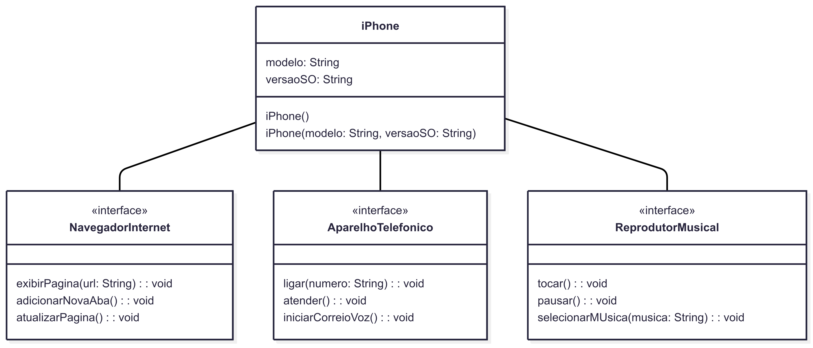

# 📱 Modelagem UML e Implementação do Componente iPhone

**Desafio de Programação Orientada a Objetos**
*Modelagem e implementação das funcionalidades básicas de um iPhone*

## 📋 Sobre o Desafio

Este projeto foi desenvolvido como parte de um desafio de POO para modelar e implementar as funcionalidades essenciais de um iPhone, baseado no lançamento original de 2007. O objetivo foi praticar:

- Diagramação UML de interfaces e classes
- Implementação de múltiplas interfaces em Java
- Separação de conceitos por responsabilidades
- Aplicação dos princípios SOLID


## 💻 Estrutura do Código

```
src/
├── iphone/
│   ├── ReprodutorMusical.java
│   ├── AparelhoTelefonico.java
│   └── NavegadorInternet.java
└── iPhone.java
```

## 📌 Princípios Aplicados

### SOLID
- **Single Responsibility**
  Cada interface tem uma única responsabilidade bem definida
- **Interface Segregation**
  Interfaces específicas para cada funcionalidade (música, telefonia, navegação)
- **Dependency Inversion**
  Dependência de abstrações (interfaces) ao invés de implementações concretas

### POO
- **Encapsulamento**
  Atributos privados com controle de acesso via métodos públicos
- **Polimorfismo**
  Capacidade do iPhone de ser tratado como qualquer uma das interfaces que implementa
- **Abstração**
  Interfaces definindo contratos claros sem expor detalhes de implementação

## 🔧 Melhorias Futuras

- **Tratamento de Erros**
  Adicionar validações e exceções customizadas para as operações
- **Persistência de Dados**
  Implementar armazenamento para lista de músicas, contatos e favoritos do navegador
- **Interface Gráfica**
  Desenvolver frontend para simular a experiência real do usuário
- **Padrão Observer**
  Notificar componentes sobre mudanças de estado (ex: chamada recebida)
- **Testes Unitários**
  Adicionar suite de testes automatizados para garantir qualidade do código

## 🖼️ Diagrama UML

